# `rtmpose_tennis/app.py` 运行流程与代码说明

本文以 [`rtmpose_tennis/app.py`](../rtmpose_tennis/app.py) 的实际控制流为准，说明 RTMPose 网球人体姿态原型从进程启动、读帧、检测与姿态推理，到展示、指标统计和资源清理的完整过程。代码入口是 `main()`（第 847 行），仅当脚本作为主模块执行时才会调用它（第 1418–1419 行）。

> 代码同步状态（2026-08-27）：已执行 `git fetch origin --prune` 与 `git pull --ff-only`。`origin/main` 没有比本地更新的提交；本地 `main` 比远端领先 7 个既有文档提交。本文对应当前本地 `main` 的 `e99d534`。

## 一、整体职责

应用读取摄像头或视频帧，在每个需要推理的帧上选出主要球员，输出其 COCO 17 个关键点、置信度和边界框，并可实时绘制骨架。它提供三条推理路线：

| 模式 | 启用条件 | 每次推理做什么 | 适用场景 |
| --- | --- | --- | --- |
| 常规模式 | 默认，未使用检测间隔且未指定 `--whole-image` | `MMPoseInferencer` 内部执行人检测与姿态估计，然后选取居中且面积较大的球员 | 通用的多人画面 |
| 全图模式 | `--whole-image` | 跳过人检测，直接对整帧做姿态估计 | 单球员、构图稳定且优先速度的画面 |
| 混合跟踪模式 | `--detector-interval N` 或 `--detector-interval-seconds S` | RTMDet 定期重定位球员；其间只对保留的球员裁剪区运行 RTMPose，并用关键点平滑更新裁剪区 | 多人网球场景，兼顾速度与稳定性 |
| 异步检测变体 | 混合模式加 `--async-detector` | 将 RTMDet 重定位交给单飞后台线程；主线程继续对当前裁剪区执行姿态估计 | 降低检测刷新对主循环的阻塞 |

输入帧也有三种运行方式：普通摄像头或普通视频通过同步生成器逐帧处理；`--async-camera` 用后台线程持续读取摄像头，只交付最新帧；`--realtime-video` 以视频元数据 FPS 节拍释放最新帧，用于可重复地模拟实时丢帧。

## 二、完整运行流程图

下面的图包含主线程、可选的最新帧采集线程和可选的异步检测线程。虚线表示线程间通过共享状态或队列式接口交接数据；实线表示主线程中的实际执行顺序。

```mermaid
flowchart TD
    start["Python 启动 app.py"] --> guard{"__name__ == '__main__'？"}
    guard -- "否" --> definitions["只加载常量、数据类、类与函数定义"]
    guard -- "是" --> main["main()"]
    main --> args["parse_args(): 声明并解析 CLI 参数"]
    args --> valid{"参数组合和取值均有效？"}
    valid -- "否" --> argerr["parser.error(); 终止进程"]
    valid -- "是" --> setup["确定模型别名、hybrid_enabled 与运行模式文本"]

    setup --> hybridInit{"混合跟踪模式？"}
    hybridInit -- "是" --> initDet["创建 DetInferencer（RTMDet）"]
    initDet --> initCropPose["创建 crop MMPoseInferencer，det_model='whole_image'<br/>并关闭 flip_test"]
    hybridInit -- "否" --> initPose["创建 MMPoseInferencer<br/>默认检测器、--det-model 或 whole_image"]
    initPose --> disableFlip["disable_flip_test()"]
    initCropPose --> initState["初始化计时器、计数器、PlayerPose、crop 与重检测状态"]
    disableFlip --> initState
    initState --> workerChoice{"--async-detector 且混合模式？"}
    workerChoice -- "是" --> workerCreate["创建 LatestDetectorWorker 后台线程"]
    workerChoice -- "否" --> windowChoice
    workerCreate --> windowChoice{"--headless？"}
    windowChoice -- "否" --> createWindow["cv2.namedWindow()"]
    windowChoice -- "是" --> headlessInfo["打印 Headless 提示"]
    createWindow --> captureChoice{"--async-camera 或 --realtime-video？"}
    headlessInfo --> captureChoice

    captureChoice -- "否" --> syncSource["frames(): 同步 VideoCapture 生成器"]
    captureChoice -- "是" --> asyncCreate["创建 LatestFrameCapture 并取得其迭代器"]
    syncSource --> loopStart
    asyncCreate -.->|后台线程持续供帧| capLoop
    capYield -.->|只交付最新 FramePacket| loopStart

    subgraph captureThread["LatestFrameCapture 线程：仅用于 async-camera / realtime-video"]
        capLoop["_capture_loop(): VideoCapture.read()"] --> capOK{"读帧成功？"}
        capOK -- "否，实时视频结束" --> capEnd["标记 _ended；通知等待者；release"]
        capOK -- "否，摄像头异常" --> capFail["保存 _error；通知等待者；release"]
        capOK -- "是" --> capPace{"realtime_video？"}
        capPace -- "是" --> capWait["按视频 FPS 等待到 release_at"]
        capPace -- "否" --> capStamp["captured_at = decoded_at"]
        capWait --> capStamp
        capStamp --> capStore["写入唯一的 _latest FramePacket<br/>更新 sequence / 时间戳；通知等待者"]
        capStore --> capLoop
        capYield["__iter__(): 等待新 sequence<br/>返回最新帧并计算 dropped"]
    end

    loopStart["for frame_index, packet in enumerate(frame_source)"] --> loopBegin["记录循环开始；累计 processed_frames；取得 packet.frame"]
    loopBegin --> workerPollChoice{"存在 detector_worker？"}
    workerPollChoice -- "否" --> decodeStats
    workerPollChoice -- "是" --> workerPoll["poll() 取走已完成的 DetectorResult"]
    workerPoll --> workerResult{"取得结果？"}
    workerResult -- "否" --> decodeStats["记录 decode 时间与异步丢帧数<br/>frame_stage = 'reuse'"]
    workerResult -- "是" --> workerError{"后台检测出错？"}
    workerError -- "是" --> runtimeError["抛出 RuntimeError<br/>进入 finally 后继续向上传播"]
    workerError -- "否" --> applyAsyncResult["记录检测耗时、结果延迟和序列滞后<br/>select_player_bbox() → crop_around_bbox()<br/>成功则更新 player_crop"]
    applyAsyncResult --> decodeStats

    decodeStats --> inferEvery{"frame_index % infer_every == 0？"}
    inferEvery -- "否" --> outputRoute{"--headless？"}
    inferEvery -- "是" --> inferBegin["inferred_frames 加一；记录从 captured_at 到开始推理的等待时间"]
    inferBegin --> hybridLoop{"混合跟踪模式？"}

    hybridLoop -- "否" --> directMode["MMPoseInferencer(frame)<br/>whole-image 或内部 detector + pose"]
    directMode --> directSelect["select_player(result, frame.shape)"]
    directSelect --> inferenceDone

    hybridLoop -- "是" --> reason["确定 detection_reason：<br/>missing_crop → 先前重检测原因 → 时间/帧间隔到期 → 无"]
    reason --> needDetect{"需要重检测？"}
    needDetect -- "否" --> cropAvailable{"player_crop 存在？"}
    needDetect -- "是" --> asyncDetectChoice{"存在 detector_worker？"}
    asyncDetectChoice -- "是" --> submitDetect["submit(copy(frame), 原始 shape/sequence/reason)<br/>仅在线程空闲且无待取结果时接受"]
    submitDetect -.->|已接受的请求| detectorRun
    submitDetect --> cropAvailable
    asyncDetectChoice -- "否" --> syncDetect["DetInferencer(frame)；记录检测耗时<br/>select_player_bbox() → crop_around_bbox()<br/>更新 player_crop、上次检测帧和时间"]
    syncDetect --> cropAvailable
    cropAvailable -- "否" --> missingCrop["player = None；redetection_reason = 'missing_crop'<br/>记录边缘诊断"]
    cropAvailable -- "是" --> cropPose["按 player_crop 切片原帧<br/>MMPoseInferencer(crop)；记录 pose 耗时"]
    cropPose --> mapPose["select_player(crop 结果)<br/>move_pose_to_frame() 转回原帧坐标"]
    mapPose --> updateCrop["若有 pose：update_crop_from_pose() 平滑跟随<br/>并将 player.bbox 设为新裁剪区"]
    updateCrop --> assess["assess_pose_redetection():<br/>缺 pose / 低关键点 / 可行动的裁剪边缘"]
    assess --> diagnostics["保存 redetection_reason；EdgeDiagnosticStats.observe()"]
    diagnostics --> inferenceDone
    missingCrop --> inferenceDone["记录总推理耗时；有 player 时累计 pose 输出数"]

    subgraph detectorThread["LatestDetectorWorker 线程：仅用于 --async-detector"]
        detectorRun["_run(): 等待 pending DetectorRequest"] --> detectorInfer["DetInferencer(request.frame, return_vis=False)"]
        detectorInfer --> detectorStore["生成 DetectorResult<br/>保存到唯一的 _result；线程变为空闲"]
        detectorStore --> detectorRun
    end

    inferenceDone --> outputRoute
    outputRoute -- "是" --> headlessMetrics["计算帧龄、序列滞后、稳态指标<br/>按 status_interval 打印实时状态"]
    headlessMetrics --> nextFrame["记录 loop 时间；处理下一帧"]
    outputRoute -- "否" --> previewScale{"preview_scale < 1？"}
    previewScale -- "是" --> scalePreview["缩小显示帧；scale_player_pose() 仅缩放可视化坐标"]
    previewScale -- "否" --> draw
    scalePreview --> draw["draw_player(): 绘制骨架、关键点、边界框<br/>叠加 FPS、延迟、丢帧指标"]
    draw --> show["cv2.imshow(); cv2.waitKey(1)<br/>计算显示耗时、帧龄和序列滞后"]
    show --> quit{"按下 Q 或 Esc？"}
    quit -- "否" --> nextFrame
    nextFrame --> loopStart
    quit -- "是" --> cleanup["finally：取得 capture_stats<br/>关闭采集线程、检测线程和 OpenCV 窗口"]

    loopStart -->|迭代器耗尽| cleanup
    runtimeError --> cleanup
    loopStart -.->|try 块内任意位置收到 Ctrl+C| keyboard["捕获 KeyboardInterrupt；记录结束时间"]
    keyboard --> cleanup
    cleanup --> summaries["打印吞吐量、帧新鲜度、稳态指标<br/>混合模式另打印检测原因与边缘诊断"]
```



## 三、模块加载阶段：常量与数据结构

### 1. 依赖、模型预设和骨架定义（第 1–33 行）

- OpenCV（`cv2`）负责视频输入、绘制和窗口显示；NumPy（`numpy`）负责坐标、面积和百分位计算。
- `MMPoseInferencer` 是姿态估计入口；`DetInferencer` 在混合模式中独立运行 RTMDet 人体检测器。
- `POSE_MODEL_PRESETS` 将短名称映射到 MMPose 模型：`tiny`、`small` 和 `medium`；默认值是 `small`。
- `COCO_SKELETON` 定义 17 个 COCO 关键点之间需要绘制的连线，`COCO_KEYPOINT_NAMES` 为边缘重检测诊断提供可读关节名。

### 2. 运行时数据对象（第 36–136 行）

| 对象 | 字段/职责 | 在主流程中的位置 |
| --- | --- | --- |
| `PlayerPose` | `keypoints`、`scores`、`bbox` | 所有模式统一交给绘制与未来动作识别层的姿态载体 |
| `FramePacket` | 图像、解码耗时、捕获时间、序列号、丢帧数 | 同步和异步输入之间的统一帧接口 |
| `CaptureStats` | 捕获总数与第一/最后捕获时间 | 退出后计算捕获 FPS |
| `DetectorRequest` | 检测帧副本、形状、帧编号、序列号、请求时间、原因 | 主线程提交给异步检测线程 |
| `DetectorResult` | 原请求、预测、推理耗时、完成时间、异常 | 主线程轮询并应用异步检测结果 |
| `EdgeHit` / `RedetectionAssessment` | 触边的关节、边、置信度以及是否应该重检测 | 混合模式的恢复判定 |
| `EdgeDiagnosticStats` | 触边事件、边/关节分布、置信度、重复事件等累计统计 | `observe()` 在每次混合姿态结果后更新 |

`EdgeDiagnosticStats.observe()` 有两个细节：没有边缘命中时会清空连续命中状态；有命中时会分别统计原始命中、被原图边界截断的边，以及相同“关节 + 边”连续出现的次数。它只做诊断统计，不直接决定检测调度。

## 四、输入帧：同步生成器与最新帧采集器

### 1. 同步输入 `frames()`（第 648–676 行）

未启用 `--async-camera` 或 `--realtime-video` 时，`main()` 使用该生成器：

1. 根据 `--video`、`--camera` 或默认摄像头 `0` 打开 `cv2.VideoCapture`；摄像头会设置请求宽高，文件视频保持其原始尺寸。
2. 每次 `read()` 前后使用 `perf_counter()` 测量解码时间。
3. 成功则按顺序 `yield FramePacket(...)`，其 `dropped` 保持默认值 `0`。
4. 视频读完时正常结束；摄像头无法继续给帧时抛出 `RuntimeError`；无论如何都在 `finally` 中 `release()`。

这是确定性的逐帧路径：视频会以“推理能处理多快就跑多快”的速度处理，不主动丢弃帧。

### 2. 异步输入 `LatestFrameCapture`（第 138–273 行）

该类用于低延迟实时路径。构造函数打开输入、创建 `Condition`，随后立即启动名为 `camera-capture` 的守护线程。

- `_capture_loop()` 持续 `read()`，每成功一帧都覆盖 `_latest`，因此内存中始终只保留最新帧。
- 实时视频模式从容器读取 FPS，并让第 `n` 帧在 `timeline_started + n / fps` 时才发布；这模拟了真实摄像头的时间线。没有有效 FPS 的视频会在构造阶段报错。
- `__iter__()` 等待序列号变大，然后拿走当前 `_latest`。若消费端处理较慢，前后序列号之差会被写入返回包的 `dropped`，中间旧帧不会再被处理。
- 文件结束设置 `_ended`，摄像头异常保存 `_error`；迭代器据此正常返回或抛出错误。
- `close()` 先设置停止标志并唤醒线程；如果后端卡在 `read()`，会主动 `release()` 以解除阻塞后再等待线程退出。

因此，异步模式优化的是“显示/推理的帧新鲜度”，不是“处理每一帧的完整性”。

## 五、姿态选择、裁剪与恢复辅助函数

### 1. 选择主要球员（第 344–423 行）

`_instances()` 与 `_bbox()` 适配 MMPose 返回字典中预测列表及 `bbox`/`bboxes` 两种字段形式。

`select_player()` 处理姿态推理结果：遍历所有实例，跳过无关键点的实例；优先使用边界框面积，缺框时使用置信度大于 `0.2` 的关键点外接面积。其排序分数为：

```text
rank = area / (1 + 到画面中心的距离 / max(画面宽, 画面高))
```

面积大的目标更优，但远离画面中心会受到惩罚。这是“主要球员”的启发式选择，并非跨帧 ID 跟踪。

`select_player_bbox()` 对 RTMDet 结果做相似选择，但只接受 COCO 类别 `0`（person）且检测分数不低于 `--detector-score-threshold` 的框；排序额外乘以检测置信度：

```text
rank = area × detection_score / (1 + 中心距离 / max(画面宽, 画面高))
```

### 2. 绘制与坐标变换（第 426–517 行）

- `draw_player()` 复制原帧，只绘制置信度不低于 `--score-threshold` 的骨架线和关键点，并绘制 `bbox`。没有球员时返回未标注副本。
- `scale_player_pose()` 仅为缩放预览创建新对象，不会修改全分辨率推理结果；这保证下游关键点坐标始终相对原图。
- `crop_around_bbox()` 将框按 `margin` 外扩并裁剪到图像边界；无有效面积则返回 `None`。`crop_around_player()` 优先用姿态框，否则用至少 4 个可见关键点建立框。
- `move_pose_to_frame()` 将裁剪图的局部关键点加上裁剪左上角偏移，恢复为原图坐标；返回的边界框是当前裁剪区，而不是模型原始框。

### 3. 混合模式的轻量跟踪与重检测（第 520–603 行）

每次裁剪姿态推理后，代码先做轻量跟踪，再判断是否要安排昂贵的 RTMDet 重检测。

`update_crop_from_pose()` 的顺序为：从高置信关键点取得目标框 → 加边距 → 限制目标宽高在当前宽高的 85%–120% → 用 `tracking_alpha` 对中心和尺寸做指数式线性平滑 → 再裁剪到图像边界。关键点少于 4 个或目标框无效时保持旧裁剪区。

`assess_pose_redetection()` 返回以下原因之一：

| 条件 | 返回原因 | 含义 |
| --- | --- | --- |
| `player is None` | `missing_pose` | 当前裁剪未得到姿态 |
| 高置信关键点数小于 `--tracking-min-keypoints` | `low_keypoints` | 姿态质量不足 |
| 高置信关键点进入裁剪区四周 `--redetect-edge` 比例的边缘带 | `crop_edge` | 球员可能将离开裁剪区 |
| 其余情况 | `None` | 当前裁剪继续可用 |

当触发边本身已经贴住原图边界时，这一边不属于“可行动命中”：检测器也无法看到原图外的像素。若所有命中都属于这种情况，`clamped_only_suppressed=True`，不请求 `crop_edge` 重检测，但仍保留诊断数据。

## 六、命令行解析与参数约束（第 679–844 行）

`parse_args()` 定义参数并在启动模型前做全部验证。重要参数分组如下：

| 分组 | 参数 | 要点 |
| --- | --- | --- |
| 输入与时间线 | `--camera`、`--video`、`--async-camera`、`--realtime-video`、`--width`、`--height` | 摄像头和视频互斥；实时视频必须配视频；异步摄像头不能与视频或实时视频组合 |
| 模型 | `--model`、`--device`、`--det-model`、`--whole-image` | `--whole-image` 不能与 `--det-model` 或混合模式组合 |
| 混合检测 | `--detector-model`、`--detector-device`、`--detector-score-threshold`、两个检测间隔、`--async-detector` | 帧间隔与秒间隔互斥；检测设备和异步检测仅在混合模式合法 |
| 裁剪跟踪 | `--crop-margin`、`--tracking-alpha`、`--tracking-min-keypoints`、`--redetect-edge` | 分别检查非负、`[0, 1]`、至少 1、`[0, 0.5)` |
| 输出与统计 | `--infer-every`、`--score-threshold`、`--preview-scale`、`--headless`、`--status-interval`、`--metrics-warmup-seconds` | `infer-every >= 1`；预览缩放在 `(0, 1]`；无界面状态间隔必须大于 0 |

任何非法组合调用 `parser.error()`，因此不会发生模型下载、摄像头打开或后台线程创建。

## 七、`main()`：初始化顺序（第 847–971 行）

1. 调用 `parse_args()`，以任一检测间隔是否非零计算 `hybrid_enabled`，并解析姿态模型别名。
2. 初始化模型：
   - 混合模式：创建独立 `DetInferencer`；若姿态设备是 `mps` 且未显式指定检测设备，检测器自动改用 `cpu`；再创建 `det_model='whole_image'` 的裁剪姿态推理器。
   - 非混合模式：创建一个 `MMPoseInferencer`。`--whole-image` 时显式绕过检测器；否则可选地传入 `--det-model`。
   - 两种姿态推理器都会调用 `disable_flip_test()`。该函数在模型暴露 `test_cfg` 时关闭 `flip_test`，避免实时场景中额外的镜像前向推理。
3. 初始化滚动计时队列、会话级样本列表、计数器、`player`、`player_crop`、重检测状态和边缘统计对象。滚动窗口主要用于界面/实时状态；会话列表用于最终 p50/p95/max 汇总。
4. 只有 `--async-detector` 的混合模式会创建 `LatestDetectorWorker`；否则检测器完全在主线程执行。
5. 非 `--headless` 时创建 OpenCV 窗口；随后按输入选项选择同步生成器或 `LatestFrameCapture`。
6. 记录会话起点、统计预热结束时刻和状态打印基线，进入 `try` 包裹的逐帧循环。

## 八、逐帧主循环的精确顺序（第 972–1290 行）

### 1. 帧到达、后台检测结果与采样节流

循环首先累计处理帧数，保留同步输入的首/末捕获时间，并取得 `packet.frame`。

若有异步检测线程，主线程先 `poll()`：

- 无结果：立即继续；不会阻塞等待检测完成。
- 有错误：转换为 `RuntimeError`，随后通过 `finally` 清理资源并向调用方传播。
- 有预测：记录检测推理时间、从请求到消费的总延迟和源帧序列滞后；随后选择人物检测框、生成裁剪区。成功时覆盖 `player_crop` 并清空恢复原因；若从未拥有裁剪区则保持 `missing_crop`。

之后记录解码耗时和 `packet.dropped`。`frame_stage` 初始为 `reuse`。只有 `frame_index % infer_every == 0` 时才会执行任何推理；其他帧复用上一帧的 `player`，但仍会进入显示或无界面指标路径。

### 2. 非混合推理路径

在常规和全图模式中，`next(inferencer(frame, return_vis=False))` 一次完成 MMPose 处理，然后 `select_player()` 选出主要球员。

- 全图模式将这段耗时写入 `pose_timings`。
- 常规模式把完整的“内部检测 + 姿态”耗时写入 `detector_timings`；它不是独立 RTMDet 耗时。
- 这两种路径都不维护 `player_crop`，也不运行边缘恢复逻辑。

### 3. 混合推理路径

混合模式在每个“需要推理”的帧中按以下优先级决定 `detection_reason`：

1. 没有裁剪区：`missing_crop`；
2. 上一轮姿态留下的恢复原因：`missing_pose`、`low_keypoints` 或 `crop_edge`；
3. `--detector-interval-seconds` 已到期，或 `--detector-interval` 的处理帧间隔已到期：`scheduled_interval`；
4. 否则无需检测。

如果需要检测：同步模式立即执行 RTMDet、选框并更新裁剪区；异步模式只尝试投递一个 `frame.copy()` 请求。`LatestDetectorWorker.submit()` 仅当线程未停止、未执行、无待处理请求且无未被消费的结果时返回 `True`，这保证最多一个在途任务，检测负载不会堆积。未被接受的请求不更新“上次检测”时间，也不阻塞主循环。

无论本轮是否刷新检测器，只要 `player_crop` 可用，主线程都会：

1. 从原帧按 `(x1, y1, x2, y2)` 切出 `crop`；
2. 用全图姿态模型推理该裁剪图；
3. 选择裁剪图中的主要人物并转换回原图坐标；
4. 有有效姿态时，用 `update_crop_from_pose()` 调整下一轮裁剪区，并将姿态框同步为该新裁剪区；
5. 用 `assess_pose_redetection()` 设置下一轮优先恢复原因，更新总计与稳态的边缘诊断。

如果没有裁剪区，本轮将 `player` 置空并记录 `missing_crop`。每一个执行推理的帧最后都会记录总推理耗时；有 `player` 时增加姿态输出计数。

## 九、输出、交互与性能指标（第 1152–1290 行）

### 无界面模式

`--headless` 不执行缩放、复制绘图、窗口显示或按键轮询。它仍计算：帧龄（当前完成时刻减捕获时刻）、序列滞后、稳态样本，以及按 `--status-interval` 输出的姿态输出 FPS、处理 FPS、帧龄 p50/p95、裁剪姿态平均耗时和丢帧百分比。随后立即开始下一帧。

### 有界面模式

非无界面路径会：

1. 在 `preview_scale < 1` 时缩小显示帧，并复制一份按相同比例缩放的可视姿态；推理输入和 `player` 原始坐标不受影响。
2. 调用 `draw_player()`，再计算模型 FPS、输出循环 FPS、输入/输出耗时和延迟字符串并叠加在画面上。
3. 调用 `cv2.imshow()` 与 `cv2.waitKey(1)`；随后记录显示耗时、帧龄、异步源的当前序列滞后和稳态分类帧龄。
4. 若键为 `q` 或 Escape，跳出循环；否则记录循环耗时并进入下一帧。

`model_fps` 是滚动 `inference_timings` 的倒数，`output_fps` 是滚动主循环耗时的倒数；二者分别反映推理吞吐和实际显示循环吞吐，不能混为同一指标。

## 十、停止、清理与最终报告（第 1291–1419 行）

`KeyboardInterrupt` 会被单独捕获：记录结束时刻、输出停止提示，然后进入 `finally`。其他异常并不被吞掉，但同样先执行 `finally`。

清理顺序固定为：取得采集统计快照 → 关闭 `LatestFrameCapture`（若有）→ 关闭 `LatestDetectorWorker`（若有）→ 销毁 OpenCV 窗口（非无界面）。同步输入不需要采集线程，因此以循环中记录的时间戳构造 `CaptureStats`。

正常结束、按键退出或 Ctrl+C 后，程序打印：

- 会话时长、捕获/处理/推理帧数、捕获 FPS、输出 FPS 和丢帧比例；
- 无界面模式下的有效姿态输出 FPS 与裁剪姿态延迟；
- 全会话与预热后稳态的帧龄 p50/p95/max、推理等待 p95 和最大序列滞后；
- 稳态中普通姿态帧与检测刷新帧的帧龄分布；
- 混合模式下的检测原因计数、异步检测的提交/完成/延迟/帧滞后，以及边缘触发的侧边、关节、置信度、截断与连续事件诊断。

预热窗口由 `--metrics-warmup-seconds` 控制，默认前 3 秒不计入“steady state”统计；它不影响实际推理、检测或显示逻辑。

## 十一、关键状态的生命周期

| 状态 | 初始值 | 何时更新 | 作用 |
| --- | --- | --- | --- |
| `player` | `None` | 每次实际姿态推理；非推理帧复用 | 绘制和下游姿态数据的单一输出 |
| `player_crop` | `None` | 同步/异步检测成功；或姿态轻量跟踪成功 | 混合模式下一次裁剪姿态推理的区域 |
| `redetection_reason` | `None` | 检测成功时清空；姿态缺失、质量低或触边时写入 | 让下一次推理优先恢复而不是等待定时检测 |
| `last_detection_frame` / `last_detection_at` | 负间隔值 / 负无穷 | 被接受的异步请求或完成的同步检测 | 帧间隔或时间间隔调度的基准 |
| `FramePacket.sequence` | 同步从 0 递增；异步线程从 0 递增 | 每次成功读帧 | 计算异步输入丢帧、检测结果滞后和显示滞后 |

## 十二、代码阅读时应注意的边界

- `select_player()` 是面积与中心位置的启发式选择，尚不是具备身份保持能力的多目标跟踪器；被遮挡或画面构图突变时可能切换对象。
- `--infer-every > 1` 时，中间展示帧使用的是旧姿态，不代表对每张显示帧都重新执行了推理。
- 异步检测故意允许结果相对于当前帧滞后；它的目标是避免主循环阻塞。最终报告会显式给出请求到结果延迟和帧序列滞后。
- 全图模式适合单人构图，但不包含紧凑裁剪和周期性重定位；混合模式不能与它组合。
- 本文件中的“检测耗时”依模式而不同：混合模式是独立 RTMDet 刷新耗时；默认模式则记录 MMPose 的联合处理耗时。比较性能时必须结合运行模式解读。
